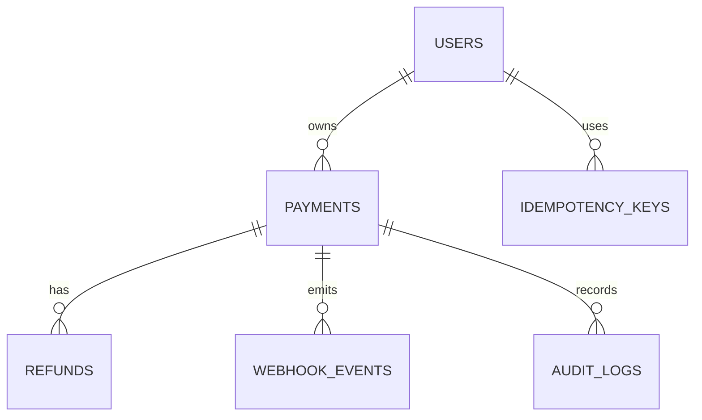

# Payment Processing Simulator

A production-style Spring Boot backend that simulates a payment gateway. It never connects to a real provider and never stores real card data, but it models the backend concerns you would discuss in an SDE interview: JWT auth, role-based access, PostgreSQL, Flyway, idempotency, state transitions, concurrency-safe processing, refunds, webhooks, audit logs, filtering, and scheduled retries.

The repository also includes a very simple React frontend in `frontend/` for trying the main flows manually.

## Architecture

```text
Client
  |
  v
REST Controllers -> DTO validation -> Services / domain components
                                      |
                                      v
                         Spring Data JPA repositories
                                      |
                                      v
                              PostgreSQL + Flyway

Background workers:
PaymentProcessingService async completion
WebhookRetryScheduler retry delivery
```

Packages:

- `controller`: HTTP endpoints only
- `service`: business workflows and transaction boundaries
- `payment`: state machine and deterministic simulator
- `webhook`: simulated event creation and retry delivery
- `audit`: append-only audit events
- `security`: JWT authentication and Spring Security integration
- `repository/entity`: persistence model

## Tech Stack

Java 21, Spring Boot 3, Maven, Spring Web, Spring Security, JWT, Spring Data JPA, Hibernate, PostgreSQL, Flyway, Bean Validation, Springdoc OpenAPI, JUnit 5, Testcontainers-ready dependencies, Docker Compose.

## Features

- Merchant registration and JWT login
- Admin and merchant roles
- Payment creation with idempotency keys
- Deterministic payment simulation
- Controlled payment state machine
- Atomic concurrent payment processing guard
- Full and partial refunds
- Concurrent refund protection using a payment row lock
- Webhook event records and retry scheduler
- Audit logs for important events
- Payment filtering, sorting, pagination, and statistics
- Swagger UI at `/swagger-ui.html`
- Basic React frontend for login, payment creation, processing, listing, and refunds

## Payment Lifecycle

```text
PENDING -> PROCESSING -> SUCCEEDED
                      -> FAILED
PENDING -> CANCELLED
SUCCEEDED -> REFUND_PENDING -> REFUNDED
SUCCEEDED -> REFUND_PENDING -> PARTIALLY_REFUNDED
```

State transitions are enforced by `PaymentStateTransitionService`; APIs never accept arbitrary status updates.

## Deterministic Simulation

Use `simulationToken` in payment creation:

- Card ending `4242`: succeeds
- Card ending `4000`: fails permanently
- Card ending `4111`: temporary failure marker
- UPI `success@upi`: succeeds
- UPI `fail@upi`: fails

Only a safe token/last-four style value is stored for cards.

## Idempotency

`POST /api/payments` requires `Idempotency-Key`. The service hashes the canonical request body and stores the original JSON response in `idempotency_keys`. The database enforces unique `(merchant_id, idempotency_key)`.

- Same key and same body: original response is replayed
- Same key and different body: `409 IDEMPOTENCY_KEY_REUSED`
- Simultaneous identical requests: database uniqueness is the final race guard

## Concurrency

Payment processing uses an atomic conditional update:

```sql
update payments
set status = PROCESSING
where id = ? and status = PENDING
```

Exactly one concurrent request can move a payment from `PENDING` to `PROCESSING`; the others receive a conflict.

Refunds use `PESSIMISTIC_WRITE` on the payment row while calculating remaining refundable amount. This serializes competing refund requests and prevents over-refunding.

## Webhooks

Important payment/refund events create `webhook_events`. `WebhookRetryScheduler` scans due pending events and retries with exponential backoff: 1s, 2s, 4s, 8s up to `WEBHOOK_MAX_RETRIES`.

The fake receiver is:

```text
POST /api/test-webhooks/receive
```

## Database Schema



Flyway migrations create tables, constraints, indexes, and seed development data.

## Running Locally

With Docker:

```bash
docker compose up --build
```

Backend: `http://localhost:8080`

Frontend: `http://localhost:5173`

Without Docker, install JDK 21, Maven, and PostgreSQL, then set:

```bash
DB_URL=jdbc:postgresql://localhost:5432/payment_simulator
DB_USERNAME=payment
DB_PASSWORD=payment
JWT_SECRET=replace-with-at-least-32-random-characters
mvn spring-boot:run
```

Run the frontend separately:

```bash
cd frontend
npm install
npm run dev
```

## Seed Users

All seeded users use password `password`.

- `admin@example.com`
- `merchant1@example.com`
- `merchant2@example.com`

## Example API Calls

Register:

```bash
curl -X POST http://localhost:8080/api/auth/register \
  -H "Content-Type: application/json" \
  -d '{"name":"Demo Merchant","email":"demo@example.com","password":"password123"}'
```

Login:

```bash
curl -X POST http://localhost:8080/api/auth/login \
  -H "Content-Type: application/json" \
  -d '{"email":"merchant1@example.com","password":"password"}'
```

Create payment:

```bash
curl -X POST http://localhost:8080/api/payments \
  -H "Authorization: Bearer TOKEN" \
  -H "Idempotency-Key: demo-key-1" \
  -H "Content-Type: application/json" \
  -d '{"amount":1500.00,"currency":"INR","description":"Test payment","paymentMethod":"CARD","simulationToken":"4242"}'
```

Process payment:

```bash
curl -X POST http://localhost:8080/api/payments/PAYMENT_ID/process \
  -H "Authorization: Bearer TOKEN"
```

Refund:

```bash
curl -X POST http://localhost:8080/api/payments/PAYMENT_ID/refund \
  -H "Authorization: Bearer TOKEN" \
  -H "Content-Type: application/json" \
  -d '{"amount":500.00,"reason":"Customer requested refund"}'
```

## Testing

```bash
mvn test
```

The current test skeleton covers the state machine and deterministic simulator. The next expansion should add Testcontainers integration tests for database constraints, idempotency races, concurrent processing, and concurrent refunds.

## Design Decisions

- Flyway owns schema creation; Hibernate validates it.
- DTO records keep persistence entities out of API responses.
- JWT lives in Spring Security filters, not controller logic.
- Payment state changes are centralized in a transition component.
- Idempotency response replay stores the exact JSON response.
- Processing delay is outside long-running database locks.
- Payment process concurrency uses an atomic update.
- Refund concurrency uses a pessimistic lock because remaining refundable amount depends on existing refund rows.

## Future Improvements

Kafka or RabbitMQ for webhook/payment events, Redis for distributed idempotency caching, distributed tracing, Micrometer metrics, Kubernetes manifests, rate limiting, richer admin dashboards, and real provider adapter interfaces for non-simulator deployments.
